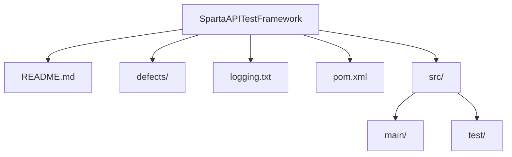
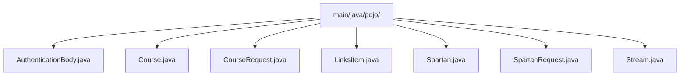
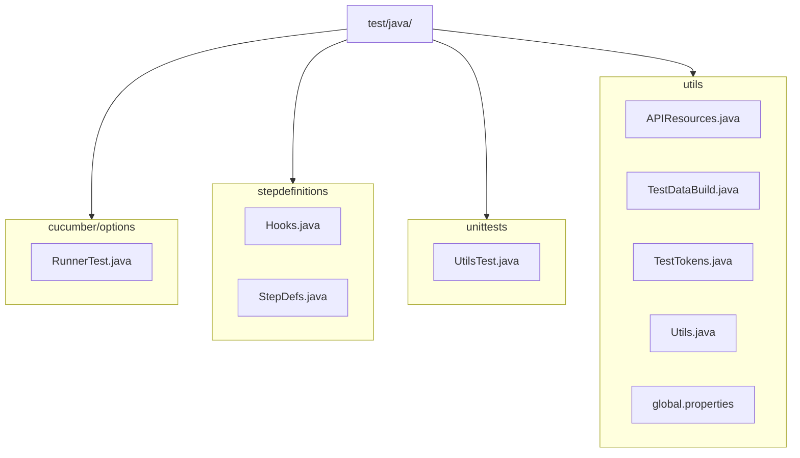
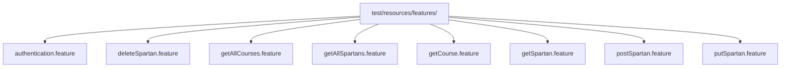

# Test Framework for SpartaAcademyAPI

## Overview
This repository contains a comprehensive and extensible test framework for testing the SpartaAcademyAPI.
It is designed to validate API responses and includes both happy path and sad path scenarios.

The framework supports integration, unit, and data-driven testing, and leverages industry-standard tools to promote team collaboration, automation, and CI/CD readiness.

## Features

-  **Cucumber Integration** – Enables BDD-style testing and readable scenarios for cross-team collaboration
-  **Data-Driven Testing** – Supports parameterised test cases to handle multiple input variations
-  **Mockito** – For mocking dependencies in unit tests
-  **RestAssured** – Simplifies HTTP request/response handling in Java
-  **JUnit** – For test execution and lifecycle management
-  **Automated Test Reporting** – Generates Surefire and Cucumber reports (HTML + JSON)
-  **GitHub Actions Integration** – Automatically runs tests and uploads reports as build artifacts

## Prerequisites
- Java 21 
- Maven 
- Docker (for local SUT container)
- Git

## Setup
1. Clone this repository:
   ```sh
   git clone https://github.com/SeanWin/SpartaAPITestFramework.git
   cd SpartaAPITestFramework
   ```
2. Start the SUT (SpartaAcademyAPI). Click [here](https://testingcircle.sharepoint.com/sites/SpartaGlobalHO/Shared%20Documents/Forms/AllItems.aspx?id=%2Fsites%2FSpartaGlobalHO%2FShared%20Documents%2FAcademy%2FPost%2DAcademy%20Pathways%2FJava%20Test%2FSpartaAcademyApp%2Ezip&parent=%2Fsites%2FSpartaGlobalHO%2FShared%20Documents%2FAcademy%2FPost%2DAcademy%20Pathways%2FJava%20Test)
to download and review the setup instructions in the README
3. Install dependencies:
   ```sh
   mvn clean install  
   ```


## Running The Tests
 - All Cucumber scenarios + unit tests + generate reports

   ```sh
   mvn clean verify
   ```
 - Only cucumber scenarios (by tag) 
   ```sh
   mvn test -Dcucumber.filter.tags="@Happy"
   ```
 - Only unit tests
   ```sh
   mvn test -Dtest=UtilsTest
   ```
## Test Reports
- Surefire `target/surefire-reports`
- Cucumber JSON `target/jsonReports/cucumber-report.json`
- Cucumber HTML `target/cucumber-html-reports/overview-features.html`

You can also download artifacts from the GitHub Actions run.

## Framework Architecture

### High‑Level Structure


### POJOs

### Test Code

### Feature files


## Contributing
1. Clone the repository.
2. Create a feature branch:
   ```sh
   git checkout -b feature/your-feature
   ```
3. Commit your changes:
   ```sh
   git commit -m "Add your feature"
   ```
4. Push to the branch:
   ```sh
   git push origin feature/your-feature
   ```
5. Create a Pull Request.

## Defect Reports
All defects I found have been noted down as a defect report in the `defects/` folder. If 
you find anymore, please log them following the naming convention and use the existing reports as examples.

